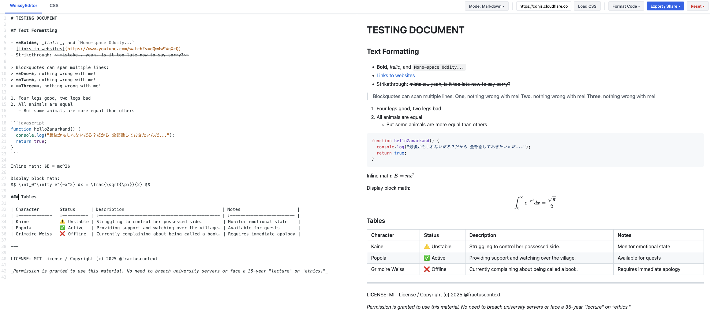

# WeissyEditor: A Grimoire for Markdown and HTML

> _I am NOT a mere text box! I am a Markdown renderer, HTML playground, CSS designer, live preview, share encoder, code formatter, and drag-and-drop loader!_

A single-file editor for writing Markdown or HTML, previewing with custom CSS, and exporting clean HTML/PDF... without touching Pandoc or installing anything, designed by and for people who are tired of the **Pandoc Cycle of Misery**.

### Get Started

**[Try Here!!](https://fractuscontext.github.io/weissy-editor/)**

...or download and open the HTML file in your browser!

## 😡 The "Why Does This Even Exist??" (A Manifesto)

I built this because I refused to install another 40MB binary just to write meeting minutes.

**My previous workflow was a nightmare:**

1. Write Markdown in VS Code
2. Assume the CSS works (it doesn't)
3. Run `pandoc input.md -o output.html`
4. Open browser
5. **Realize I forgot the `-s` (standalone) flag**
6. Run Pandoc again
7. **Realize Pandoc added `<colgroup>` tags that broke my table layout and the `` tags embedded in the header**
8. Spend 10 minutes manually deleting HTML tags or writing a Lua filter to fix it
9. Print to PDF
10. Question my life choices

## Features

| Category               | Feature                 | Description                                                                                         |
| ---------------------- | ----------------------- | --------------------------------------------------------------------------------------------------- |
| Privacy & Architecture | 🔒 100% Client-Side     | No data is ever uploaded to a server. All processing happens locally in your browser.               |
|                        | ⚡ Zero-Install         | Single .html file architecture. Works offline, no binaries, no compiling.                           |
|                        | 💾 Local Persistence    | Auto-saves content, CSS, mode, and scroll position to browser localStorage.                         |
| Editing & Core         | 👁️ Dual Mode & Preview  | Switch between Markdown (GFM) and HTML with instant, synced rendering.                              |
|                        | 🧮 Rich Text Support    | Native $ LaTeX $ math (KaTeX) and automatic syntax highlighting for code blocks.                    |
|                        | 🧹 Integrated Formatter | One-click Prettier formatting for Markdown, HTML, and CSS.                                          |
|                        | 🛡️ Granular Reset       | Separate reset options for content or CSS with double-click protection.                             |
| Styling                | 🎨 Custom CSS Control   | Dedicated CSS editor tab with hot-reload (no refresh needed).                                       |
|                        | 🌐 External Stylesheets | Load CSS frameworks directly from any CDN URL (e.g., GitHub, cdnjs).                                |
| File I/O & Sharing     | 📂 Smart Drag-and-Drop  | Drop .md or .html to load content; drop .css to apply styles instantly.                             |
|                        | 🔗 Serverless Sharing | Encodes the entire document & CSS into a URL string (PlantUML-style). Share by sending a link.      |
|                        | 📤 Flexible Export      | Download source files (.md/.html/.css) or open the rendered result in a clean tab for PDF printing. |

## 🛑 Anti-Features & Scope

This tool is treated as a "graphical script," not a product. It is designed to be a single, lightweight HTML file that works today and will still work in 10 years without updates.

**What this is NOT (and never will be):**

- **Not a "Second Brain":** No backlinking, graph views, or knowledge management. This is for writing meeting minutes, not competing with Obsidian.
- **Not a Platform:** There is no server. There is no database. You own your data because it never leaves your browser.
- **Not an IDE:** This is not VS Code. If you need extensions, use a real IDE.
- **Not an App:** No Electron, Tauri, or binaries. The goal is to avoid installing 40MB of junk just to write text.
- **Not a PDF Engine:** It relies on the browser to render valid HTML so `Ctrl+P` actually works.

### 🔮 Potential Future Additions (If I Need Them)

**Future Scope:**
I will add new features if I personally need them and they're:

- Open Source: Can be implemented via existing JS or WASM libraries (e.g., Paged.js for printing or a Lisp/Scheme interpreter).
- Offline Capable: Must work when cached (CDN-delivered but cacheable).
- Solves a Real Problem: No "nice-to-haves" or feature bloat.

This is a tool that solves one problem well, not a platform trying to do everything.

## 🏛️ Standing on the Shoulders of Giants

This project is powered by open-source libraries, loaded directly via CDN:

- **CodeMirror 5** – The robust text editor interface.
- **Marked.js** – A low-level markdown compiler.
- **KaTeX** – Fast math typesetting.
- **Highlight.js** – Syntax highlighting for the web.
- **Prettier** – An opinionated code formatter.
- **Pako** – High speed zlib port for URL state encoding.

## 📄 License

MIT License, Copyright (c) 2025 fractuscontext

_Permission is granted to use this material. No need to breach university servers or face a 35-year "lecture" on "ethics."_
